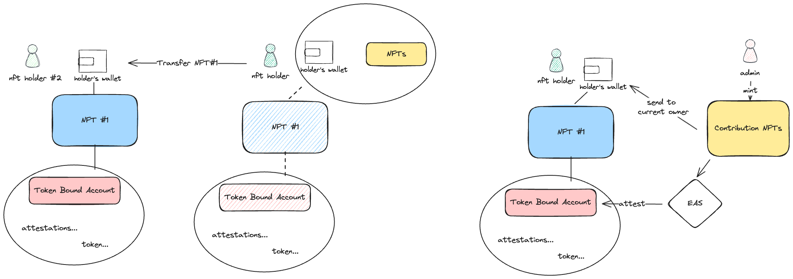
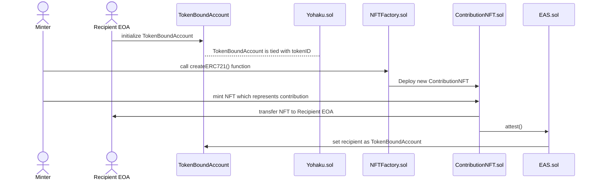

# [] yohaku

[](https://github.com/yohakuxyz/yohaku-contract/actions/workflows/test.yaml) [](https://github.com/yohakuxyz/yohaku-contract/actions/workflows/slither.yaml) [](https://opensource.org/licenses/MIT)

Yohaku is a project to promote community contribution activities using cutting-edge decentralized technologies, born from the terraced rice paddy restoration efforts in the Ueyama area of Mimasaka City, Okayama Prefecture.

The Ueyama area is a beautiful "satoyama" with about 8,300 terraced rice paddies, but due to depopulation and aging, the number of abandoned farmland is increasing, making it difficult to maintain the terraced rice paddies that boast a thousand years of history.

Furthermore, it is a region where the issues faced by rural Japan, such as cultural inheritance, town maintenance, lack of successors, and the dilution of local communities, are concentrated.

Yohaku uses blockchain technology to solve these regional issues, increasing the number of people who support the region and providing a mechanism to properly evaluate their contributions.

Specifically, Yohaku NFT will be issued to new participants, and the reporting of contribution activities will be reflected in [EAS (Ethereum Attestation Service)](https://attest.org/).

Users who have made a certain contribution will be issued an NFT to prove it, and will be able to manage it with TBA (Token Bound Account).

The four main features of Yohaku are **"self-governance"**, **"scalability"**, **"succession"** and **"outcome-oriented"**.

We believe that the future of the region should be decided by the people involved in the region, that digital technology can overcome geographical and community constraints, that the contributions of each individual can be passed on to the next generation, and that concrete results should be evaluated.

In particular, the "succession" mechanism allows the accumulation of contributions to be passed on to the next bearer with the approval of multiple users when the current holder is unable to continue regional activities due to circumstances, enabling community contributions across generations. Yohaku will first conduct a demonstration experiment in the Ueyama area through NFT distribution challenges and actual regional activities, and then expand the model to other areas.

In the future, we will promote collaboration with other regions facing similar issues by making it open source. Yohaku is an ambitious project that challenges regional issues and sustainable community building with the power of decentralized technology. The new approach, which is based on the spontaneous activities of local people while supporting them with digital technology and fostering them as an "unstoppable infrastructure" across generations, may become a model case for regional revitalization in Japan.

## Table Of Contents

- [\[\] yohaku](#-yohaku)
  - [Table Of Contents](#table-of-contents)
  - [Deployments](#deployments)
    - [Factory](#factory)
    - [Yohaku (Proxy)](#yohaku-proxy)
  - [Implementation](#implementation)
    - [Overview](#overview)
  - [Quick start](#quick-start)
    - [Clone repository](#clone-repository)
    - [Setup](#setup)
    - [Build](#build)
    - [Fork testing](#fork-testing)

## Deployments

### Factory

| Network (chainId) | Address                                                                                                                          |
| ----------------- | -------------------------------------------------------------------------------------------------------------------------------- |
| 10                | [0x2300cb3e09733b6F7390328976CdD7878f068877](https://optimistic.etherscan.io/address/0x2300cb3e09733b6F7390328976CdD7878f068877) |
| 11155111          | [0xa57d81bDD038fCFEC275580b2d3F38dfD8B125dc](https://sepolia.etherscan.io/address/0xa57d81bDD038fCFEC275580b2d3F38dfD8B125dc)    |

### Yohaku (Proxy)

| Network (chainId) | Proxy Address                                                                                                                    | Implementation Address                                                                                                           |
| ----------------- | -------------------------------------------------------------------------------------------------------------------------------- | -------------------------------------------------------------------------------------------------------------------------------- |
| 10                | [0x241b846142C5b06C904db55438248e2c98cA55d6](https://optimistic.etherscan.io/address/0x241b846142C5b06C904db55438248e2c98cA55d6) | [0x1F6385D8409C23AEB0641C9176F46c4C09520CD5](https://optimistic.etherscan.io/address/0x1F6385D8409C23AEB0641C9176F46c4C09520CD5) |
| 11155111          | [0x241b846142C5b06C904db55438248e2c98cA55d6](https://sepolia.etherscan.io/address/0x241b846142C5b06C904db55438248e2c98cA55d6)    | [0x1F6385D8409C23AEB0641C9176F46c4C09520CD5](https://sepolia.etherscan.io/address/0x1F6385D8409C23AEB0641C9176F46c4C09520CD5)    |

## Implementation

### Overview





## Quick start

### Clone repository

```shell
git clone https://github.com/yohakuxyz/yohaku-contract.git
cd yohaku-contract
```

### Setup

```shell
pnpm setup
```

if you haven't installed foundry yet, follow [the official installation guide](https://book.getfoundry.sh/getting-started/installation)

### Build

```shell
pnpm build
```

### Fork testing

make sure you setup environment variables

```shell
source .env && pnpm test:op
```
